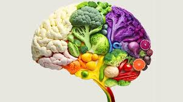

# Desempeño profesional y personal

El desempeño profesional y personal juega un papel crucial en la construcción de un futuro sostenible. En el ámbito profesional, la sostenibilidad no solo se relaciona con el cumplimiento de normativas ambientales, sino también con la implementación de estrategias que generen un impacto positivo en la sociedad y el medio ambiente. Esto incluye adoptar prácticas responsables, como la gestión eficiente de recursos, la innovación en procesos productivos y la promoción de una cultura organizacional comprometida con los Objetivos de Desarrollo Sostenible (ODS).

Por otro lado, el desempeño personal implica tomar decisiones conscientes en la vida cotidiana, como reducir el consumo de plásticos, optimizar el uso de energía y fomentar hábitos de reciclaje. Estas acciones, aunque parezcan pequeñas, tienen un efecto acumulativo que contribuye significativamente a enfrentar los retos ambientales globales. Además, el compromiso personal con la sostenibilidad influye directamente en la forma en que cada individuo interactúa con su entorno y sirve de ejemplo para inspirar cambios en los demás.

La integración de estos desempeños refuerza la idea de que el desarrollo sostenible no es solo una responsabilidad colectiva, sino también un compromiso individual y profesional que demanda coherencia y acción en todos los aspectos de la vida. A través de la alineación de metas personales y profesionales con los ODS, es posible generar un impacto transformador en el camino hacia un mundo más equitativo y respetuoso con el medio ambiente.
