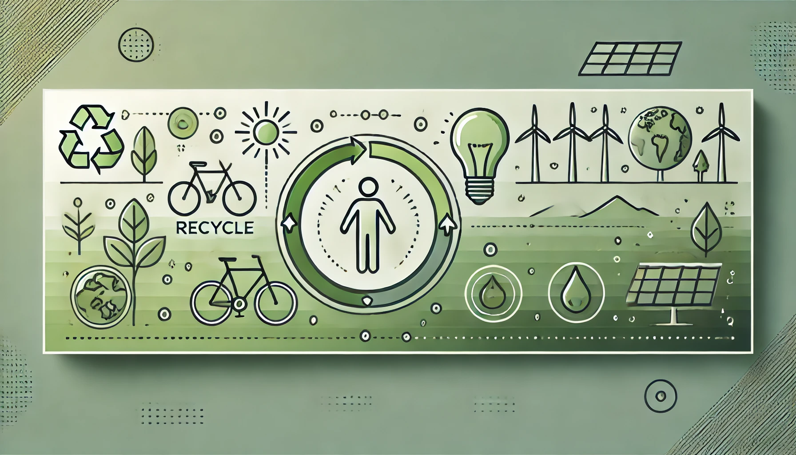

# Prácticas sostenibles en el ambiente personal

En un mundo donde los desafíos ambientales son cada vez más evidentes, es crucial que tanto en el ámbito personal como profesional se adopten prácticas sostenibles. 
Cada acción individual, la educación ambiental y el impulso a la innovación son pilares fundamentales para construir una sociedad más responsable y comprometida con el cuidado del planeta. 
A través de estos enfoques, no solo reducimos nuestro impacto ambiental, sino que también contribuimos al desarrollo de un futuro más equilibrado y duradero.

## **1. Impacto de las acciones individuales en el medioambiente**  
Cada acción que realizamos tiene un efecto directo o indirecto en el medioambiente. Desde pequeñas decisiones como apagar las luces cuando no las necesitamos, hasta la forma en que nos desplazamos al trabajo, todo cuenta. Por ello:  

- Es esencial fomentar **hábitos responsables**, como reducir el consumo de plásticos, reciclar correctamente y optar por energías limpias.  
- En el ámbito profesional, esto se traduce en la implementación de prácticas como el uso eficiente de los recursos, la digitalización de procesos y la gestión adecuada de los residuos generados en el trabajo.  
- Una conciencia ambiental individual repercute en una mejora colectiva, ya que las acciones de cada persona se suman a los esfuerzos globales para preservar el medioambiente.  

---

## **2. Educación como motor de transformación ambiental**  
La educación es la herramienta más poderosa para cambiar el mundo, y en el caso de la sostenibilidad, su impacto es fundamental. Promover la educación ambiental en todos los niveles tiene múltiples beneficios:  

- **Conocimiento y sensibilización:** Educar sobre los retos ambientales actuales permite a las personas comprender la urgencia de adoptar prácticas sostenibles.  
- **Formación en competencias verdes:** Capacitar a profesionales de todas las áreas para que integren la sostenibilidad en su desempeño diario, desde la construcción hasta la tecnología.  
- **Fomento del liderazgo ambiental:** Una educación enfocada en sostenibilidad puede inspirar a las personas a ser agentes de cambio en sus comunidades y empresas.  

Invertir en educación ambiental no solo transforma comportamientos individuales, sino que fortalece la capacidad de las sociedades para enfrentar desafíos globales como el cambio climático.

---

## **3. Innovación como clave para la sostenibilidad**  
La innovación es uno de los pilares esenciales para avanzar hacia un futuro más sostenible. En este contexto, representa un cambio en la manera de hacer las cosas, reduciendo el impacto ambiental y creando valor.  

- **Desarrollo de soluciones tecnológicas:** La innovación permite generar energías más limpias, fabricar materiales ecológicos y diseñar procesos más eficientes.  
- **Transformación de modelos de negocio:** Las empresas pueden adoptar prácticas como la economía circular, que minimiza el desperdicio al reutilizar y reciclar recursos de forma constante.  
- **Impulso a la creatividad y la adaptación:** La sostenibilidad no solo exige cambios tecnológicos, sino también repensar cómo vivimos y trabajamos, fomentando ideas disruptivas que promuevan un equilibrio entre desarrollo y conservación.  

Integrar la innovación con la sostenibilidad genera beneficios no solo ambientales, sino también económicos y sociales, favoreciendo un modelo de desarrollo más justo y duradero.
