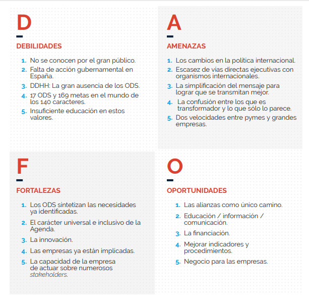

# Riesgos y oportunidades que representan los ODS 

https://www.pactomundial.org/noticia/dafo-los-objetivos-desarrollo-sostenible/?utm_source=chatgpt.com

Los Objetivos de Desarrollo Sostenible de Naciones Unidas es el plan de acción más ambicioso a favor de las personas, el planeta y la prosperidad hasta 2030. El Pacto Mundial tiene el mandato de las Naciones Unidas para sensibilizar al sector privado y a las empresas al respecto.

### MATRIZ DAFO:

## ¿Con qué ODS está relacionado la industria, la innovación y la infraestructura?

https://ods.dnp.gov.co/es/objetivos/industria-innovacion-e-infraestructura?utm_source=chatgpt.com

La industria, innovación y la infraestructura esta relacionado con el **Objetivo 9**

9.1 - Infraestructuras Sostenibles e Inclusivas

Desarrollar infraestructuras fiables, sostenibles, resilientes y de calidad, incluidas infraestructuras regionales y transfronterizas, para apoyar el desarrollo económico y el bienestar humano, haciendo especial hincapié en el acceso asequible y equitativ

9.2 - Promover la industrialización inclusiva y sostenible

Promover una industrialización inclusiva y sostenible y, de aquí a 2030, aumentar significativamente la contribución de la industria al empleo y al producto interno bruto, de acuerdo con las circunstancias nacionales
